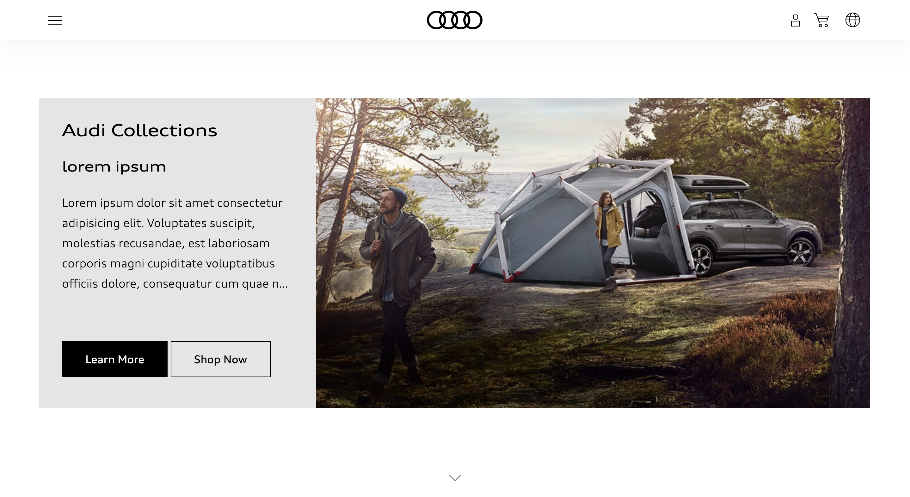
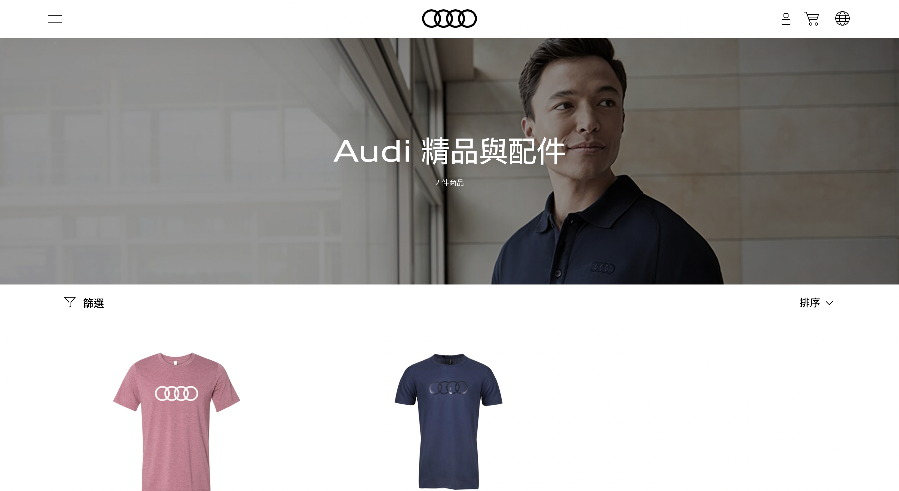
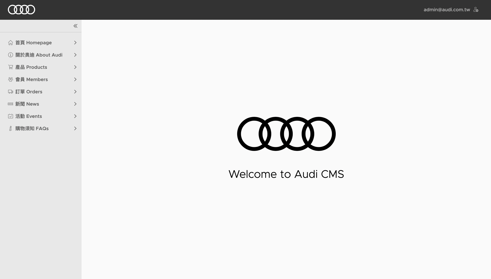
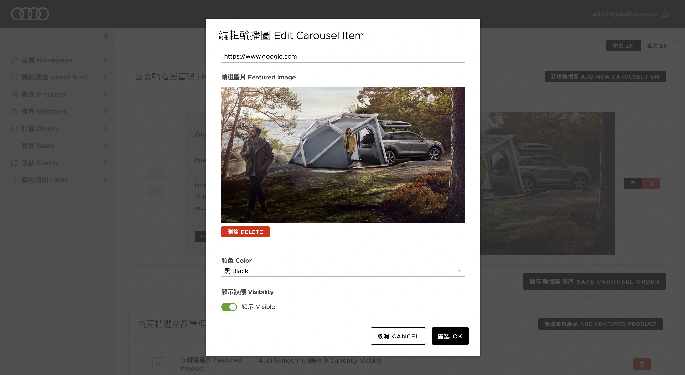

### Description

A conceptual eCommerce site with a full-fledged CMS built for my favorite car brand: Audi.

Stack: .NET Core 5, Postgresql, Angular 12, Tailwind CSS, Clarity, Audi UI. Deployed via Docker and GCP.

<!-- [E-Commerce Site Demo](http://35.201.150.30:80/) -->





<!-- [Backend CMS Site Demo](http://35.201.150.30:80/sys/) (username: admin; pw: @udi4dminPw) -->





---

### Setup

Database is being hosted on a dockerized pg sql instance. If you do not have docker, install docker and setup docker container (see, e.g., https://hub.docker.com/_/postgres):

`docker run --name {dockerContainerName} -e POSTGRES_USER={userName} -e POSTGRES_PASSWORD={password} -p {portToBindToPostgres}:5432 -d postgres:latest`

1. get a cloudinary account, and update the fields in `CloudinarySettings` of your `appsettings.json` with your credentials.
2. create a `appsettings.Development.json` file under `API`, copy the properties from `appsettings.json` and fill them out. Make sure you are pointing your database connection to a pgsql db.
3. `cd` to `API`, run `dotnet restore`, and set your aspnetcore environment to `Development`
4. run `dotnet watch run` to setup db, seed data, and spin up APIs
5. `cd` to `client` and run `npm i`
6. run `npm run start:public` or `npm run start:sys` to spin up angular project accordingly
7. have fun!

---

### Dotnet API

`cd` to `server/Audi`

Generate Initial Migrations:

`dotnet ef migrations add InitialCreate -o Data/Migrations`

Generate Migrations:

`dotnet ef migrations add ${MigrationName}`

Remove Migrations:

`dotnet ef migrations remove`

Apply Migrations/Create Database:

`dotnet ef database update`

Drop Db:

`dotnet ef database drop`

Run Project:

`dotnet watch run`

Note: seed data can be generated via: https://www.json-generator.com/

To quickly convert the models to typescript interfaces, use the JSON to TS extension in VSCode and paste the returned values from the API there.

---

### Angular

`cd` to `client`

`npm i`

Run ecommerce site project:

`npm run start:public`

Run backend CMS project:

`npm run start:sys`

---

### Local Docker Environment

To run this project via docker, run the following commands in your terminal:

1. In the root folder, run `docker-compose build` to build the docker image
2. Then, after the image is built, run `docker-compose up -d` to launch the image in the background process

Notes:

- the pgsql db is run internally on 5432 port of the docker VM, exposed by docker on 5439 port
- the dotnet api is run internally on 8800 port of the docker VM, exposed by docker on 6578 port
  - API endpoint: localhost:6578/api
  - Swagger endpoint: localhost:6578/swagger
- the angular project is run internally on 80 port of the docker VM, exposed by docker on 8080 port
  - public project: localhost:8080
  - sys project: localhost:8080/sys/

For documentation on how this is setup, see:

- https://medium.com/geekculture/docker-net-core-5-0-angular-11-nginx-and-postgres-on-the-google-cloud-platform-pt-1-363160e34439

---

### Deployment

Notes:

```
This app is hosted via GCP with dockerized images of this solution through a pretty hacky way.

Not sure what the best way to do this is as i couldn't figure out how to deploy the entire docker network created via "docker-compose build" together.

I had to push these images one by one to GCP and I don't know how to contain them under one IP with different ports like they are setup in my "docker-compose build".
```

To deploy, you will need the following GCP APIs enabled:

1. VPC network
2. Container Registry
3. VM instances
4. Kubernetes Engine

Also, you need to host your pgsql somewhere: I chose to use AWS RDS because I couldn't figure out how to connect to GCP's Cloud SQL via their auth proxy. (https://aws.amazon.com/getting-started/hands-on/create-connect-postgresql-db/)

Get the outgoing IP and credentials of the cloud db, set it up in your `appsettings.Production.json`.

Login to docker with `docker login`

Login to gcloud with `gcloud auth login`

Then, build and deploy your api image to gcloud first:

1. `cd server && docker build --build-arg "ENV=PROD" -t audi-ecommerce-concept_production_api .`

2. `docker tag audi-ecommerce-concept_production_api gcr.io/<YOUR_PROJECT_ID>/audi-ecommerce-concept_production_api`

3. `gcloud builds submit --tag gcr.io/<YOUR_PROJECT_ID>/audi-ecommerce-concept_production_api`

<!-- 3. `docker push gcr.io/<YOUR_PROJECT_ID>/audi-ecommerce-concept_production_api` -->

After the image is created in your container registry (https://console.cloud.google.com/gcr/), go to kubernetes (https://console.cloud.google.com/kubernetes/) and create a cluster, then go to workloads and deploy the image.

After it is deployed, expose the image (workload) and get its external IP.

Then, go to External Addresses under VPC Network (https://console.cloud.google.com/networking/addresses/list) and make that IP static.

Next, in your angular projects' `environment.production.ts` (both `sys` and and `public`), replace `apiUrl` with the IP of the api container's external ip.

Then, build and push the angular image:

1. `cd client && docker build --build-arg "ENV=PROD" -t audi-ecommerce-concept_production_web .`

2. `docker tag audi-ecommerce-concept_production_web gcr.io/<YOUR_PROJECT_ID>/audi-ecommerce-concept_production_web`

3. `gcloud builds submit --tag gcr.io/<YOUR_PROJECT_ID>/audi-ecommerce-concept_production_web --timeout=3600`

<!-- 3. `docker -- push gcr.io/<YOUR_PROJECT_ID>/audi-ecommerce-concept_production_web` -->

follow the same steps listed about, e.g., deploy and expose the image's ip, set it to static.

lastly, you will need to go to your `appsettings.Production.json` of the dotnet project and set the config property `ProductionAngularUrl` to the angular deployment's IP, and then redeploy the api image. 

See below on how to perform rolling updates on the kubernetes deployment when you push a new docker image.

References:

1. https://towardsdatascience.com/how-to-deploy-docker-containers-to-the-cloud-b4d89b2c6c31
2. https://medium.com/google-cloud/deploying-docker-images-to-google-cloud-using-kubernetes-engine-637af009e594

On how to perform rolling updates on GCP Kubernetes, e.g., use new docker image on same workload/service, see:

- https://cloud.google.com/kubernetes-engine/docs/how-to/updating-apps#console
- basically, once the image is built, go to Container Registry and copy the latest image name, then go to Kubernetes Engine > Workload tab > click into Workload and click Edit > in yaml tab, update the docker image tag under "containers" > click save
  - remember to set `imagePullPolicy` to `Always` in the yaml file so you don't need to manually restart your deployment.
  - if you dont' want to do that, go to "KUBECTL" tab in your workload, which opens up the terminal, then:
    - `kubectl get deployment` to see all deployments
    - `kubectl rollout restart deployment <deployment_name>` to restart your deployment (not necessary if you set `imagePullPolicy` to `Always`)
    - `kubectl rollout status deployment <deployment_name>` to see status of your deployment's rollout
    - `kubectl rollout history deployment <deployment_name>` to see rollout history of a deployment

---

##### Features to be implemented / Bugs to be fixed, in no particular order:

#### API

- Email Template UI for all system emails (order placed, order status update, sign up, forget pw, etc.)
- SignalR for live chat
- site-wide search
- email / messaging / inbox functionality
  - inbox system for users, admin can send promo messages to them
  - notification system for pushing notification to users
- Statistics table and repo / controller

#### Angular Sys Project

- live chat module with signalr
- sys inbox thread with users
- notification push system
- ngx charts for statistics

#### Angular Public Project

- convert to Angular universal
- live chat
- site-wide search
- inbox thread between user and moderator
- notification system
